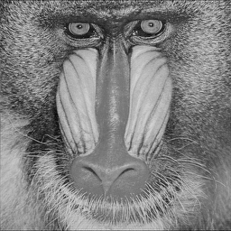

ndarray-downsample2x
====================
Downsamples an ndarray by a factor of 2 using sinc interpolation.

## Example
Here is a simple example showing how to downsample an image:

```javascript
var baboon = require("luminance")(require("baboon-image"))
var x = require("zeros")([256,256])
require("../downsample.js")(x, baboon)
require("save-pixels")(x, "png").pipe(process.stdout)
```

#### Output


##Install
Install using [npm](https://www.npmjs.com/):

    npm install ndarray-downsample2x

## API    
#### `require("ndarray-downsample2x")(output, input[, clamp_lo, clamp_hi])`
Downsamples input by a factor of two storing the result in output.

* `output` gets the result of downsampling
* `input` is the array that gets downsampled
* `clamp_lo` is a threshold placed on the pixeks
* `clamp_hi` is an upper threhsold placed on the pixels

**Note** `input`'s shape must be divisible by 4 and `output`'s shape must be one half of `input`'s along each dimension.

## License
(c) 2013 Mikola Lysenko. MIT License